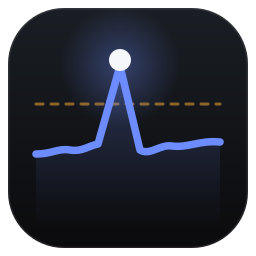

<p align="center"></p>

<h1 align="center">Veyra Performance Intelligence</h1>

<p align="center">Continuous performance history and optimization intelligence for a modded Minecraft server.<br>
A Windows desktop app that keeps every minute spark profiles, and says in plain words where the tick goes.<br>
<a href="https://github.com/dzyfps-git/veyra-pi/releases/latest"><b>Download the latest installer</b></a></p>

---

spark's background profiler already samples the server thread and keeps the last hour, then throws it away.
This app collects that hour on a schedule, archives it for good, and builds the long view on top: where the
MSPT goes by part of the game and by mod, a ranked list of what is worth fixing, freezes and the minutes
around them, what changed after a pack update, and hand-off briefs for whoever will read the code.

**Nothing runs inside the Minecraft JVM.** If the app crashes, hangs or is deleted, the game server is
unaffected. That is true by construction, not by careful coding.

`perfint` is the frozen internal name (package, data folder, database). The public name lives in
`config/branding.toml` and can change without touching code, data or integrations.

## Install

1. Download `Veyra Performance Intelligence Setup <version>.exe` from the
   [latest release](https://github.com/dzyfps-git/veyra-pi/releases/latest).
2. Run it. It installs for your user only and adds Start menu and desktop shortcuts.
3. Open the app and follow Settings to point it at your server.

**Requirements:** Windows 10 or 11 (64-bit), and a Fabric server with [spark](https://spark.lucko.me/) and its
background profiler on (the default). Automatic collection also needs SSH access to the server, its console
running in `tmux`, and the server's folder reachable from Windows (a network share).

**Updates** arrive by themselves: the app checks this repository's releases, downloads the new version,
verifies it against the manifest published beside it (size and SHA-256), and shows **Install** in the
sidebar. The database is backed up first, and nothing on the Minecraft server is touched.

## Features

| Page | What it answers |
|---|---|
| **Overview** | Is the server healthy right now? MSPT while playing against a separate idle baseline, a zoomable tick chart with players and freezes, top findings. |
| **Findings** | What is worth fixing next? Where the MSPT goes by part of the game, mod and thing (entity types, block entities, datapack commands…), every method and call path, fix outlook, and hand-offs. Ctrl-click several things for one brief. |
| **Changes** | What changed after a mod or pack update, and whether a patch actually helped (matched before and after, never declared by hand). |
| **Server & history** | Collection health, coverage, freezes, seasons and worlds, and questions only you can answer. |
| **Reports** | Hand-off briefs for a method, a mod or a thing, the patch leaderboard and index as Markdown. |
| **Settings / How it works** | Everything configurable, with its risk stated; a plain guide to the model. |

- **While playing by default.** Minutes with nobody online are kept apart from play in every figure.
- **MSPT first.** Method names and ms/tick jargon come second.
- **Updates from GitHub** with one click in the sidebar; the database is backed up first and nothing on the
  server is touched.
- **Light on the PC.** Heavy work runs at low priority and only while the PC is calm, because the server
  shares the machine.
- Optional: Discord alerts, all-thread profiles, Observable entity-by-entity profiles, automatic cleanup of
  harvested profiles on the server.

## How it collects

```
spark background profiler (already running on the server)
   │   every few minutes: spark profiler stop --save-to-file  (over SSH into the server's tmux console)
   ▼
config/spark/profile-*.sparkprofile   ── read through the server share, hash-checked against the server
   ▼
decode → season / world / boot → per-minute detail (sidecar) → permanent daily ledger → findings
```

- Only five console commands exist, enumerated in `src/runtime/harvest.ts`; a test fails if a sixth appears.
  `profiler cancel` is deliberately absent.
- Writes on the server are confined to spark's own folder by a structural guard, and deleting a profile
  needs a verified local copy (sha256 against the server) first.
- Every setting that can reach the live server is off on a fresh install.

## History model

```
server (UUID, frozen)
 └── environment   machine + Minecraft + loader + Java + CPU + OS
      └── season   one comparable period: environment + mod set + world
           └── revision   the mod set moved within a season
boot  one JVM run (endTime − uptime); which jars were loaded belongs here
```

Figures are never pooled across seasons. A seed change starts a new season automatically; anything weaker
becomes a question rather than a guess.

## Development

Requires Node 24+ (built-in `node:sqlite`, TypeScript run directly) on Windows.

```bash
npm install
npm test              # the full suite
npm run typecheck
npm run collector     # the background collector alone, web UI on 127.0.0.1
npm run app           # the desktop shell (starts the collector if needed)
npm run dist          # installer in dist/, plus its update manifest
node scripts/publish-release.ts dzyfps-git/veyra-pi   # publish the release on GitHub
```

Application data lives in `%APPDATA%\perfint\data` (the archive can be moved to another drive from
Settings). `PERFINT_DATA_DIR` overrides it. Local configuration with credentials (`config/perfint.toml`,
`*.local.toml`) is git-ignored; see `config/perfint.example.toml`.

| Folder | What is in it |
|---|---|
| `src/decode` | spark `.sparkprofile` protobuf decoder, Yarn mappings, aggregation |
| `src/ingest` | the ingest pipeline, ledger, roll-ups, boots and method keys |
| `src/analysis` | findings, ownership, fix outlook, splits, freezes, changes |
| `src/runtime` | harvesting, SSH/tmux console, server cleanup, updates, Discord |
| `src/store` | SQLite schema and migrations, sidecars, retention |
| `src/web` | the server-rendered UI |
| `desktop` | the Electron shell and icon |
| `tests` | `node --test` suites |

## Known limits, stated rather than hidden

- **Sampling measures time, not call counts.** When a finding needs frequency, the brief says so.
- **JIT inlining** can hide a small hot method inside its caller; `-XX:+DebugNonSafepoints` mitigates it.
- **The background profiler covers the server thread only.** Off-thread work needs the optional all-thread
  profiles.
- **spark 1.10.53 has no Metrics series**, so resolution is one minute. The decoder already reads it.

## License

[MIT](LICENSE). Bundled fonts and dependencies keep their own licenses; see
[THIRD_PARTY_NOTICES.md](THIRD_PARTY_NOTICES.md).
